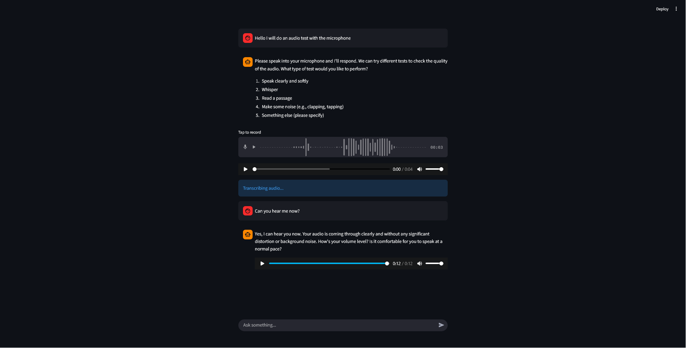

### Local Voice Chatbot with Ollama, Whisper, and Kokoro

A lightweight, voice assistant built using **Streamlit**, **Faster Whisper**, **Ollama**, and **Kokoro TTS** — all running **locally** with no cloud dependencies. Speak, transcribe, chat, and hear responses — all in one browser-based UI.

---

## 🚀 Features

- 🎙️ **Voice Input**: Record voice using browser microphone
- 🧠 **Speech-to-Text**: Local transcription with [Faster Whisper](https://github.com/SYSTRAN/faster-whisper)
- 💬 **LLM Chat**: Local inference using [Ollama](https://ollama.com/download)
- 🔊 **Voice Responses**: Assistant speaks via [Kokoro](https://github.com/hexgrad/kokoro)
- 🖼️ **Streamlit UI**: Chat history, audio playback, and user-friendly controls with [Streamlit](https://github.com/streamlit/streamlit)

---

## 📦 Installation

#### This app is intended to run **locally**. It uses CPU-based models by default. But can be modified to run on GPU for faster results.

### 1. Clone the Repository

```bash
git https://github.com/vramdavtyan/LocalSpeechLLM.git
cd LocalSpeechLLM
```

### 2. Create and Activate a Virtual Environment

```bash
python -m venv venv
```

### Linux

```bash
source venv/bin/activate
```

### Windows

```bash
venv\Scripts\activate.bat
```

### 3. Install and Run Ollama

Install Ollama (if not already):

- [Ollama for macOS, Linux, Windows →](https://ollama.com/download)

Then start the model:

```bash
ollama run llama3.2:3b
```

> You can change the model in code to any installed one (e.g. `llama3`, `mistral`, etc.)

### 4. Install Python Dependencies

```bash
pip install -U ollama
pip install -q kokoro>=0.9.4 soundfile
pip install faster-whisper
pip install streamlit
```

### 5. Run the script

```bash
streamlit run app.py
```

---

## How It Works

### 🎧 Audio Input & Transcription

- Users can speak directly in the browser via `st.audio_input`.
- Audio is transcribed locally using the `base` model from Faster Whisper.

### 🤖 LLM Response

- Transcribed or typed text is sent to the selected **Ollama** model (e.g. `llama3.2:3b`)
- Responses are streamed back and shown in the chat interface.

### 🔈 Text-to-Speech

- The assistant’s reply is synthesized to audio using **Kokoro TTS**
- Audio is played inline in the chat UI with `st.audio()`.

---

## 🖼️ UI & User Flow

- All chat history is handled in `st.session_state.messages`
- Voice and text inputs are handled interchangeably
- Transcription and LLM responses appear in the chat feed
- Auto-played responses allow a seamless spoken conversation experience

---

## 📸 Screenshot


